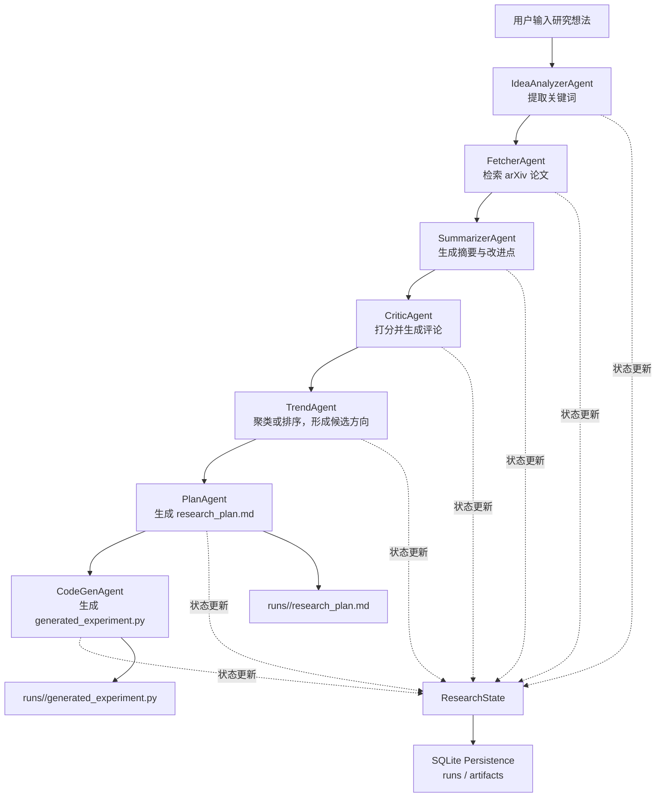

# Research Agent Lab

一个面向科研探索场景的多代理原型系统。把一段还比较粗糙的研究想法，拆成一条可执行的工作流，最后产出一份研究计划和一个实验代码骨架。

## 项目在解决什么问题

做文献调研和选题设计时，很多步骤其实都很重复：

- 从想法里抽关键词
- 去检索相关论文
- 粗读摘要并筛掉噪音
- 对论文做相关性和方法质量判断
- 归纳几个值得继续挖的方向
- 写成研究计划
- 顺手搭一个可继续开发的实验脚手架

这个项目就是把这条链路做成一个可以本地跑通的 MVP。

## 当前特性

- 多代理顺序编排：从想法分析到代码骨架生成
- 共享状态模型：所有代理围绕统一的 `ResearchState` 工作
- SQLite 持久化：保存每次运行状态与阶段产物
- 本地可运行：默认离线模式，不依赖真实 LLM 也能跑通
- 在线可切换：支持 OpenAI 兼容接口
- 产物落盘：自动生成研究计划和实验代码文件
- 测试覆盖：包含关键词提取、持久化、失败场景和端到端流程

## 流程图



## 运行流程

当前入口是 `main.py`，执行时会创建一个 `Orchestrator`，依次调用这些代理：

1. `IdeaAnalyzerAgent`
2. `FetcherAgent`
3. `SummarizerAgent`
4. `CriticAgent`
5. `TrendAgent`
6. `PlanAgent`
7. `CodeGenAgent`

编排层负责几件关键的工程工作：

- 生成 `run_id`
- 初始化共享状态
- 每一阶段后保存状态快照
- 把产物写入磁盘
- 记录错误并在失败时停止流程
- 同步写入 SQLite

## 项目结构

```text
.
├── main.py            # CLI 入口
├── orchestrator.py    # 多代理编排与产物写出
├── agents.py          # 各阶段代理
├── utils.py           # 检索、关键词、LLM、计划/代码生成等工具函数
├── models.py          # TypedDict 状态与记录结构
├── storage.py         # SQLite 持久化
├── tests/             # 单元测试与集成测试
└── runs/              # 每次运行的输出目录（运行后生成）
```

## 快速开始

安装依赖：

```bash
pip install -r requirements.txt
```

直接运行默认示例：

```bash
python3 main.py
```

传入自己的研究想法：

```bash
python3 main.py --input "多智能体系统在科研选题中的应用"
```

自定义输出位置：

```bash
python3 main.py \
  --input "多智能体系统在科研选题中的应用" \
  --db-path research_agent.db \
  --output-dir runs \
  --max-results 5
```

## 输出结果

每次运行都会生成一个新的 `run_id`，并在 `runs/<run_id>/` 下写出：

- `state.json`：当前运行的完整状态快照
- `research_plan.md`：研究计划
- `generated_experiment.py`：实验代码骨架

数据库里则会存两类记录：

- `runs`：每次运行的整体状态
- `artifacts`：每个阶段产生的快照、文件或错误信息

## 离线模式与在线模式

### 离线模式

默认就是离线模式，适合本地调试和看流程是否跑通。

这个模式下：

- LLM 输出走确定性 stub
- 检索失败时会自动回退
- 没有真实论文结果时，也会基于输入生成计划和代码骨架

### 在线模式

如果你想接真实模型，可以启用 `--live-llm`，并配置环境变量：

```bash
export OPENAI_API_KEY=your_key
export OPENAI_BASE_URL=https://api.openai.com/v1
export OPENAI_MODEL=gpt-4o-mini
```

运行方式：

```bash
python3 main.py --live-llm --input "你的研究想法"
```

如果环境没配好，系统会明确报错，并把错误写入状态和数据库，而不是静默失败。

## 测试

运行全部测试：

```bash
python3 -m unittest discover -s tests
```

当前测试覆盖的重点包括：

- 关键词提取与去重
- arXiv 返回解析与去重
- 评分结果结构
- 候选方向 fallback 逻辑
- 无论文时的计划和代码生成
- 成功/失败运行的持久化
- CLI 是否能从仓库根目录直接运行

## 下一步计划

- 检索源扩展到 Semantic Scholar、Crossref 等
- 把顺序编排升级成图编排
- 增加更强的评审与重排序逻辑
- 接入前端或 API 服务
- 引入异步任务系统处理长流程运行

## License

This project is licensed under the Apache License 2.0
