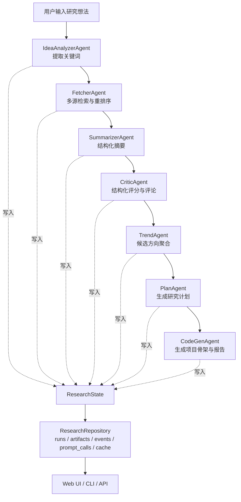

# Research Agent Lab

一个面向科研探索场景的多代理研究助手原型：从输入想法、检索论文、结构化摘要、评审和聚合，到产出研究计划、实验脚手架、运行报告和可追踪的状态记录。

- 有编排层
- 有服务层
- 有提示词模板
- 有持久化和缓存
- 有 benchmark
- 有后台任务
- 有本地 Web UI

## 它能做什么

给系统一段研究想法之后，它会按阶段完成这些工作：

1. 提取关键词
2. 从多个来源检索论文
3. 生成结构化摘要
4. 对论文做结构化评分和评论
5. 聚合候选研究方向
6. 生成研究计划
7. 生成一个最小实验项目骨架
8. 保存报告、状态快照、产物和事件记录

默认情况下，这一切都可以离线跑通。即使没有配置真实 LLM，系统也会使用确定性 fallback，把流程完整走完，适合本地调试和做系统开发。

## 现在这版的重点能力

- 多代理工作流，支持阶段级持久化
- 可恢复执行，支持从已有 `run_id` 继续
- 多源检索接口：`arXiv`、`Semantic Scholar`、`Crossref`
- 提示词模板外置，支持版本追踪
- LLM 路由、调用记录和缓存
- SQLite 仓储层，支持 run、artifact、event、prompt call 查询
- 本地 benchmark 评估
- 后台任务管理
- 本地 WSGI API
- 同源轻量前端页面

## 系统流程图



## 架构分层

这版代码按职责分成了几层：

- `orchestrator.py`
  负责阶段调度、状态更新、恢复执行、产物写出和错误处理。

- `agents.py`
  定义工作流里的代理，但代理本身只做“阶段职责”，不再直接堆业务细节。

- `services.py`
  是核心服务层，包含：
  - 检索服务
  - LLM 服务
  - 摘要 / 评审 / 选题服务
  - 研究计划与代码生成服务

- `prompt_templates/`
  放结构化提示词模板，并由 `prompting.py` 统一加载和追踪版本。

- `repository.py`
  是 SQLite 仓储层，负责持久化和查询，不只是“写库”。

- `jobs.py`
  提供后台任务执行能力。

- `api.py`
  提供 JSON API，并同时托管轻量前端。

- `evaluation.py`
  提供 benchmark 评估入口。

## Web UI

这版已经带一个本地前端页面，不需要额外前端构建工具。

启动方式：

```bash
python3 main.py --serve-api
```

然后打开：

```text
http://127.0.0.1:8000
```

页面里可以做这些事：

- 提交新的研究想法
- 选择同步运行或后台运行
- 查看最近运行历史
- 查看某次 run 的详细状态
- 查看候选研究方向
- 预览研究计划
- 查看生成文件、artifact 和事件流

前端是纯静态实现，位于 `web/` 目录，直接由 API 同源托管。

## 快速开始

安装依赖：

```bash
pip install -r requirements.txt
```

直接运行一个默认任务：

```bash
python3 main.py
```

传入自己的研究想法：

```bash
python3 main.py --input "多智能体系统如何用于科研选题与实验规划"
```

指定数据库和输出目录：

```bash
python3 main.py \
  --input "多智能体系统如何用于科研选题与实验规划" \
  --db-path research_agent.db \
  --output-dir runs \
  --max-results 8
```

## 运行模式

### 1. CLI 直接运行

适合开发和调试：

```bash
python3 main.py --input "你的研究想法"
```

### 2. Resume 已有运行

适合失败恢复或继续执行：

```bash
python3 main.py --resume-run-id your_run_id --input "原始输入"
```

### 3. 本地 API + Web UI

```bash
python3 main.py --serve-api
```

### 4. Benchmark

```bash
python3 main.py --benchmark
```

## 离线模式与在线模式

### 离线模式

默认就是离线模式。

这个模式下：

- 检索失败时会回退到离线 seed paper
- LLM 输出走确定性 fallback
- 整体工作流依旧可运行

这对系统调试非常重要，因为你不需要先解决网络、API Key、模型可用性这些问题，才能验证系统结构。

### 在线模式

如果你希望接真实模型，可以启用：

```bash
python3 main.py --live-llm --input "你的研究想法"
```

并配置环境变量：

```bash
export OPENAI_API_KEY=your_key
export OPENAI_BASE_URL=https://api.openai.com/v1
export OPENAI_MODEL=gpt-4o-mini
```

如果配置不完整，系统会明确报错，并把错误记录到状态和事件流里。

## 输出内容

每次 run 都会在 `runs/<run_id>/` 下生成产物。当前常见输出包括：

- `state.json`
- `research_plan.md`
- `report.md`
- `generated_experiment.py`
- `generated_project/configs/default.json`
- `generated_project/src/train.py`
- `generated_project/src/evaluate.py`
- `generated_project/README_experiment.md`

同时，数据库中会持久化：

- `runs`
- `artifacts`
- `events`
- `prompt_calls`
- `cache_entries`

## API 概览

当前已经提供的接口包括：

- `GET /`
  返回前端页面

- `GET /health`
  健康检查

- `GET /runs`
  查看最近运行

- `POST /runs`
  同步执行一个 run

- `POST /jobs`
  提交后台任务

- `GET /jobs/<job_id>`
  查看后台任务状态

- `GET /runs/<run_id>`
  获取完整状态

- `GET /runs/<run_id>/artifacts`
  获取 artifact 列表

- `GET /runs/<run_id>/events`
  获取事件流

- `GET /runs/<run_id>/prompt-calls`
  获取 prompt 调用记录

## 项目结构

```text
.
├── main.py
├── orchestrator.py
├── agents.py
├── services.py
├── repository.py
├── config.py
├── prompting.py
├── prompt_templates/
├── api.py
├── jobs.py
├── evaluation.py
├── web/
├── benchmarks/
├── tests/
└── settings.example.toml
```

## 测试

运行全部测试：

```bash
python3 -m unittest discover -s tests
```

目前测试覆盖：

- 关键词提取与中英文 fallback
- arXiv XML 解析与去重
- prompt 模板加载与版本追踪
- 仓储层的 run / artifact / event / cache 能力
- 检索层离线 fallback
- 编排层运行与 resume
- CLI 入口
- 后台任务
- API 健康检查和静态页面
- benchmark 评估

## 当前仍然不完美的地方

虽然系统已经比一开始完整很多，但它还远没到“科研生产力平台”的程度。现在最真实的状态是：

- 架构比以前清晰很多
- 工程链路已经成型
- 但研究质量仍然主要靠规则和 fallback 撑着

真正要继续往上走，下一步最有价值的方向还是这些：

- 强化 reranking 和论文质量判断
- 引入更强的全文解析
- 把计划和代码生成做成更严格的 schema 驱动
- 增加前端交互能力，比如人工筛论文、手动重排候选方向、局部重跑某一阶段

## License

[LICENSE](LICENSE)
